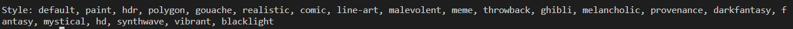
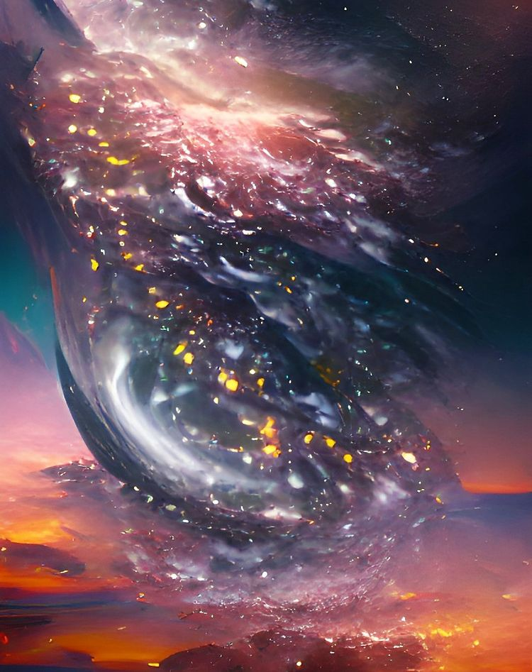

# ART GENERATOR
## Overview
Art-generator is powered by wombo AI art. You can easily generate any kind of art, including almost 21 styles for paint, fantasy, mystical, or even a specific artist style, just by typing. It can take up to 10 seconds for the art to be generated.

## Installation
+ Python version  ```3.10.5```

+ Run ``` pip install -r requirements.txt``` or ```pip3 install -r requirements.txt``` to install the required packages

## Execution
+ Run ```python main.py``` or ```python3 main.py``` to execute the program. 


+ You can type the text you want to generate.



+ Then, choose the artwork style


+ Have fun for the artwork!

## Example
+ Keyword: **Galaxy**
+ Style : **fantasy**




## For more artwork, follow me on Instagram, Twitter, and Facebook

[Instagram](https://www.instagram.com/dream.artist777/)

[Twitter](https://twitter.com/AiDreamart777)

[Facebook](https://www.facebook.com/profile.php?id=100085971112927)